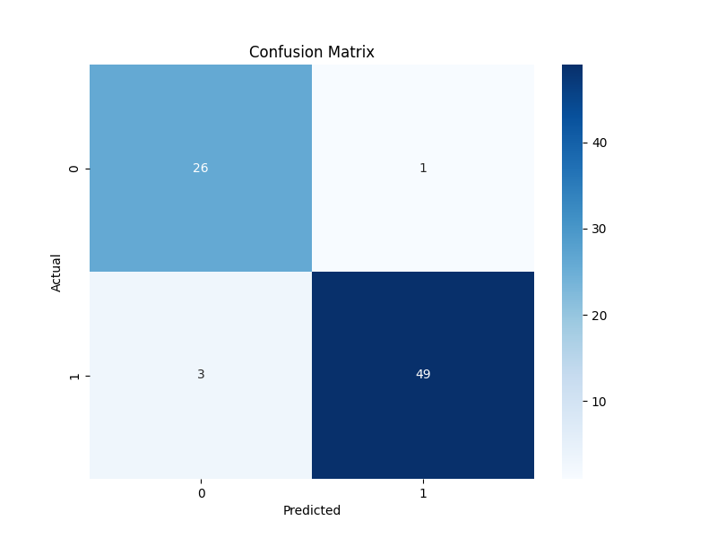
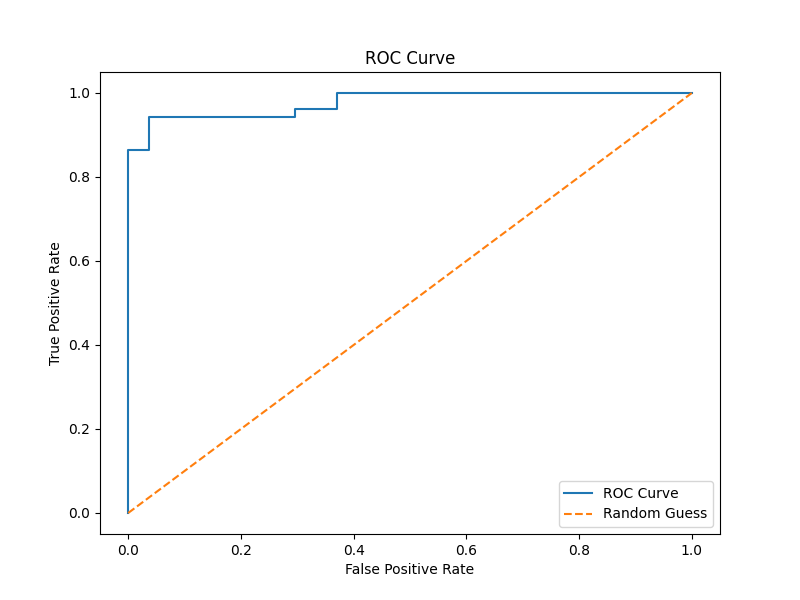
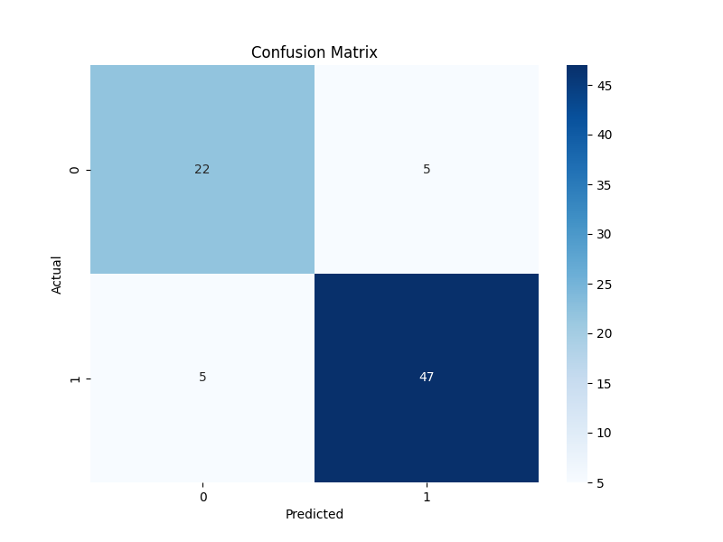
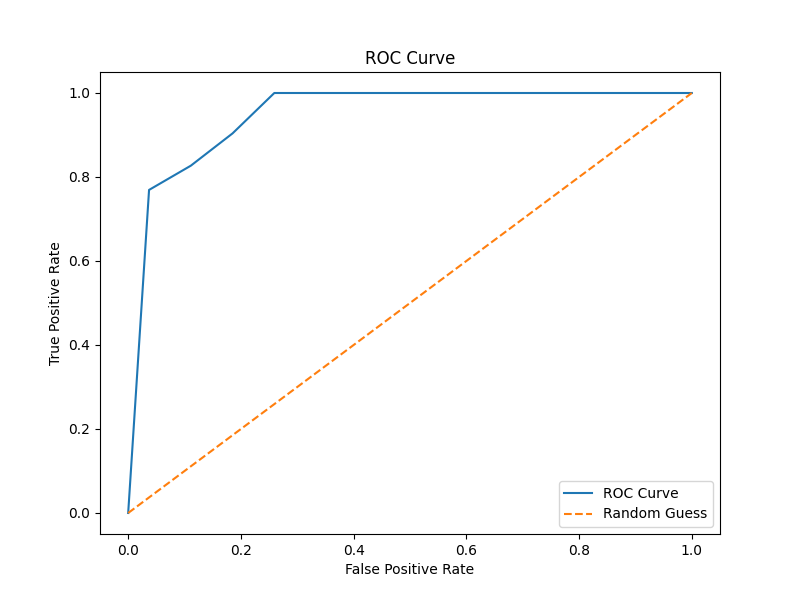
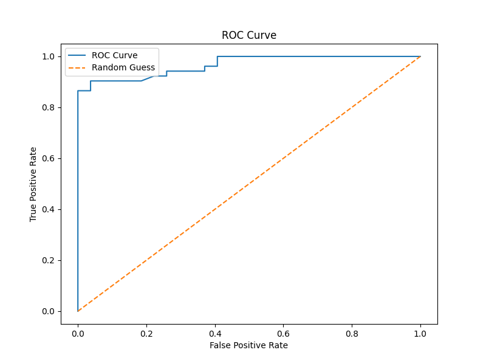
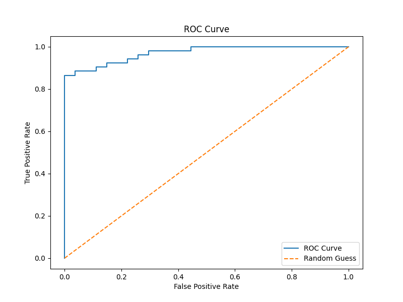

# Звіт: Використання методів штучного інтелекту для аналізу даних (класифікація з набору даних Kaggle)

## Завдання:

**Мета завдання:**

- Опанування базових методів класифікації для аналізу даних.
- Використання Python для обробки даних, побудови моделі класифікації та оцінки її ефективності.
- Застосування реального набору даних з Kaggle.

**Датасет:** `student-mat.csv` з папки `DataSet`.

## Використаний підхід:

1. **Завантаження даних:** Завантажено дані з файлу `student-mat.csv`, що знаходиться в папці `DataSet`.
2. **Попередня обробка даних:**
   - Перевірено наявність пропущених значень. Пропущені значення виявлено та оброблено: для числових даних замінено на медіану, для категоріальних - на моду.
   - Категоріальні ознаки перетворені на числові за допомогою `LabelEncoder`. Для кожного категоріального стовпця виведено інформацію про відповідність між вихідними категоріями та закодованими числовими значеннями.
   - Цільова змінна `G3` (підсумкова оцінка) перетворена на бінарну `G3_binary` (1 - "пройшов" (G3 >= 10), 0 - "не пройшов" (G3 < 10)). Перед створенням бінарної змінної виведено розподіл кількості студентів за кожною з оцінок у `G3`.
3. **Розподіл даних:** Дані розділено на тренувальний та тестовий набори у співвідношенні 80:20. Виведено розміри отриманих наборів даних.
4. **Побудова моделей:** Навчено 4 моделі класифікації:
   - Логістична регресія (виведено інформацію про параметри моделі)
   - K-Nearest Neighbors (KNN) (виведено інформацію про параметри моделі)
   - Random Forest
   - Support Vector Machine (SVM)
5. **Оцінка моделей:** Для кожної моделі розраховано метрики: accuracy, recall, precision, F1-score. Побудовано матриці плутанини та ROC-криві.

## Ключові результати:

| Модель                          | Accuracy | Recall | Precision | F1-score |
| ------------------------------------- | -------- | ------ | --------- | -------- |
| Логістична регресія | 0.8734   | 0.9630 | 0.8814    | 0.9204   |
| KNN                                   | 0.8228   | 0.8889 | 0.8710    | 0.8798   |
| Random Forest                         | 0.9114   | 0.9630 | 0.9138    | 0.9377   |
| SVM                                   | 0.8608   | 0.9630 | 0.8667    | 0.9123   |

## Графіки:

### Логістична регресія:

**Матриця плутанини:**

**ROC-крива:**

### K-Nearest Neighbors (KNN):

**Матриця плутанини:**

**ROC-крива:**

### Random Forest:

**Матриця плутанини:**

**ROC-крива:**

### Support Vector Machine (SVM):

**Матриця плутанини:**

**ROC-крива:**

## Висновки:

- Найкращу точність (accuracy) показала модель **Random Forest** (0.9114).
- Найкращий показник F1-score також у моделі **Random Forest** (0.9377).
- Модель **Логістичної регресії** показала другий результат за точністю та F1-score.
- **SVM** також показує гарні результати.
- **KNN** показала найнижчу точність серед розглянутих моделей.

**Загалом, модель Random Forest виявилася найефективнішою для даного завдання класифікації на основі наданих даних.**
